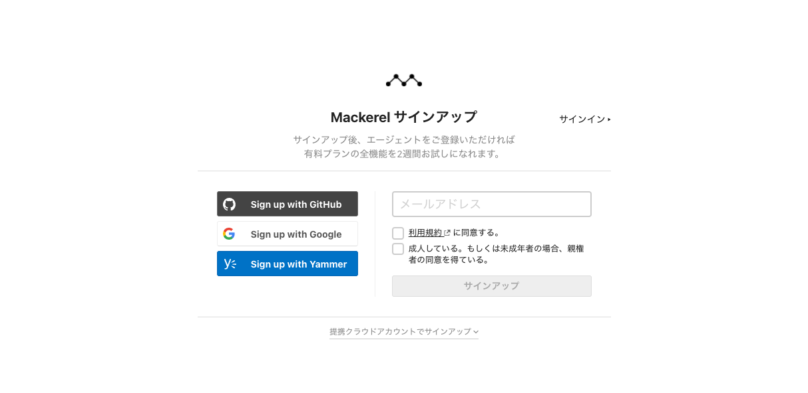
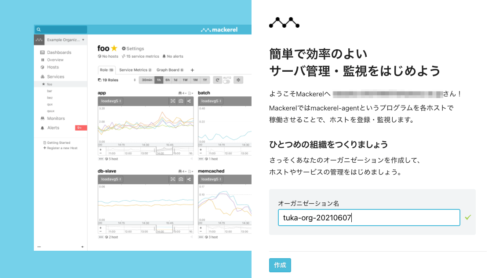
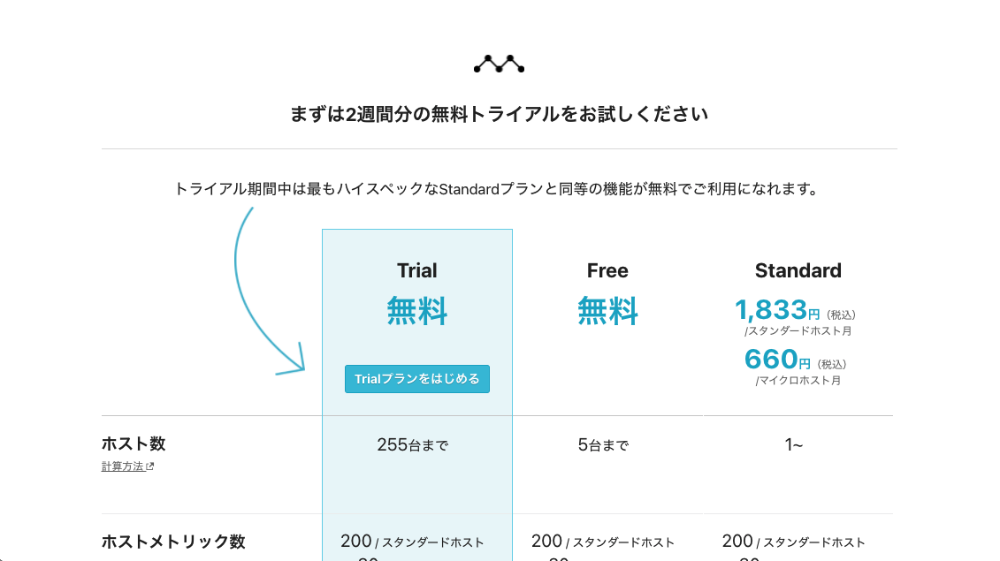
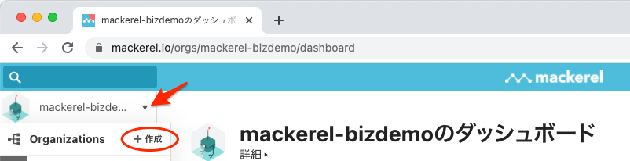

# オーガニゼーションを作成する

Mackerelでは契約の単位として「オーガニゼーション」を作成して監視対象となるホストを追加したり、メンバー（ユーザーアカウント）を追加して複数人で監視することができます。（メンバーは複数のオーガニゼーションに所属できますが、ホストはオーガニゼーションを複数またいで登録することはできません）

このハンズオンでは新規にMackerelのオーガニゼーションとユーザーアカウントを作成します。

ユーザーアカウントが未登録の場合、オーガニゼーションとあわせて登録されます。
既にユーザーアカウントをお持ちの場合は、既存のアカウントにハンズオン用のオーガニゼーションを追加で作成します。

またオーガニゼーションはMackerel全体で一意である必要があります。自社名やサービス名などでの取得にはご注意ください。

## はじめてMackerelに登録する場合
[https://mackerel.io/signup](https://mackerel.io/signup) から、アカウントの作成（サインアップ）を行ってください。

- 今日この場で受信可能なメールアドレスでの登録をお願いします。
- GitHubアカウントなどでも登録可能ですが、アラート通知を受け取るにはメール認証済みのユーザーアカウントが必要となります。

メールアドレスを入力し、利用規約と親権者の同意にチェックをしてサインアップをクリックします。

オーガニゼーション名とアンケート項目を入力して作成ボタンをクリックします。

`Trialプランをはじめる`をクリックすると作成したオーガニゼーションが開きます。

この状態だとユーザー登録が完了していません。`[Mackerel] Please verify your email`という件名のメールに表示されているURLからパスワードの登録を完了してください。

## 既にアカウントをお持ちの場合
Mackerelにログインしている状態で、画面左上にあるオーガニゼーション切り替えメニューから新規のオーガニゼーションを作成してください

