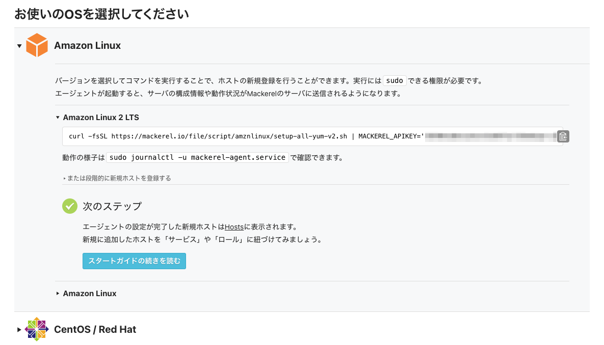
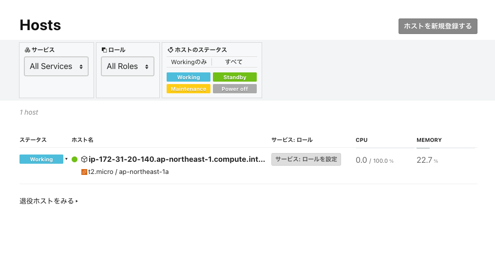

# エージェントをインストールする

このハンズオンでは監視対象となるサーバーに mackerel-agent をインストールして監視を始めます。

## エージェントをインストール

Webコンソールの左サイドメニューの下部にある[新規ホストの登録](https://mackerel.io/my/instruction-agent)にアクセスして、監視対象OSのインストールスクリプトをコピーします。



Amazon Linux2の場合は以下のような内容をコピーします。（貸与しているハンズオンサーバーは`Amazon Linux2`となります）
- コマンドの右端にあるクリップボードアイコンからコピーできます。
- `<YOUR API KEY>`は環境によって異なります。

```shell
curl -fsSL https://mackerel.io/file/script/amznlinux/setup-all-yum-v2.sh | MACKEREL_APIKEY='<YOUR API KEY>' sh
```

コピーしたインストールコマンドをターミナル上で実行します。

以下のように表示されればインストールが成功して監視が始まっています！

```shell
 :
*************************************

     Done! Welcome to Mackerel!

*************************************
```

## 登録されたホストを見てみる

インストールが完了したら[Hosts](https://mackerel.io/my/hosts)にアクセスして、mackerel-agentをインストールしたホストが登録されているか確認してみましょう。（反映までに1〜2分かかる場合があります）



ホスト名をクリックしてホスト詳細画面にアクセスし、 mackerel-agent が収集する情報にどのようなものがあるかメトリック仕様と照らし合わせて確認してみてください。

- [メトリック仕様 - Mackerel ヘルプ](https://mackerel.io/ja/docs/entry/spec/metrics)

## インストールが上手く行かない場合

インストールが正常に行なえない場合、以下などに該当していないかご確認ください。

### 異なるOSのインストールコマンドを実行してしまった場合

Amazon Linux2 の環境に Amazon Linux のインストールコマンドを実行してしまったなどの場合は、mackerel-agent のアンインストールとリポジトリの削除を行い、改めて正しいインストールスクリプトを実行する必要があります。

アンインストールの一連の手順は以下を実行してください。

```shell
sudo yum remove -y mackerel-agent mackerel-agent-plugins mackerel-check-plugins mkr
sudo rm /etc/yum.repos.d/mackerel.repo
sudo yum remove mackerel-repo.noarch
sudo yum clean all
```

### インストール後にmackerel-agentが起動しない場合

インストールしたホストからインターネットへの通信が行えていないなどが考えられます。

mackerel-agentのログを確認して、どのようなエラーが発生しているかなど確認をしてください。

```shell
sudo journalctl -u mackerel-agent.service
```