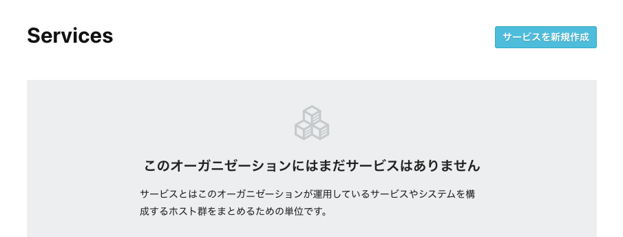
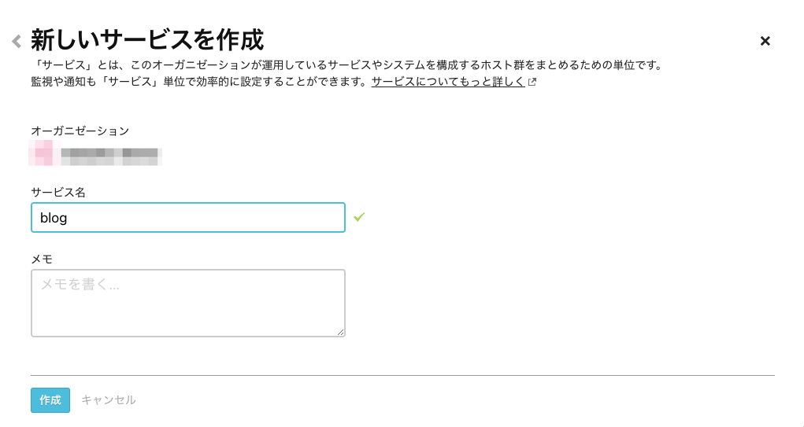
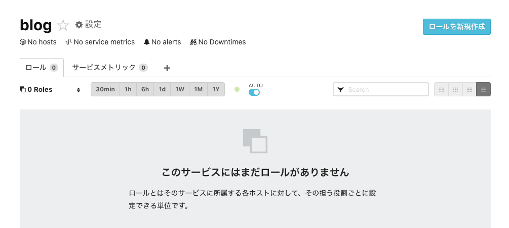
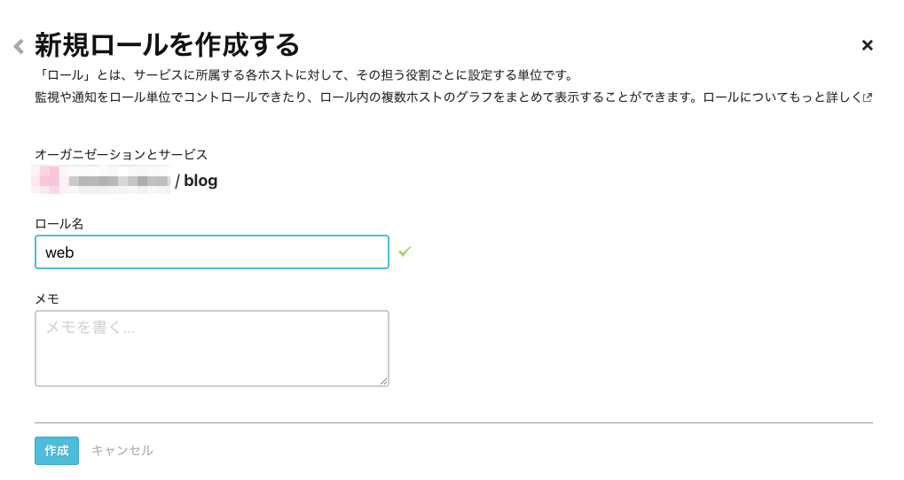
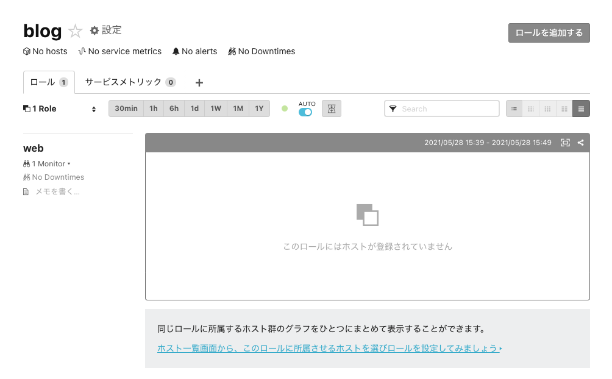
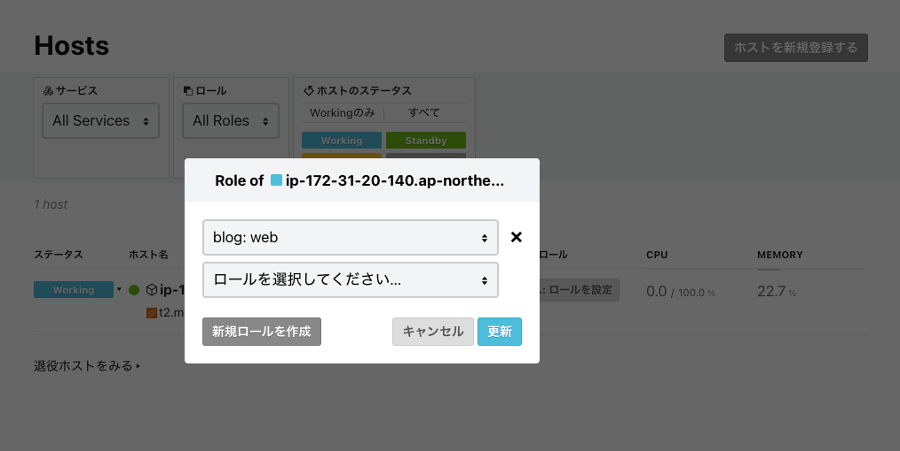
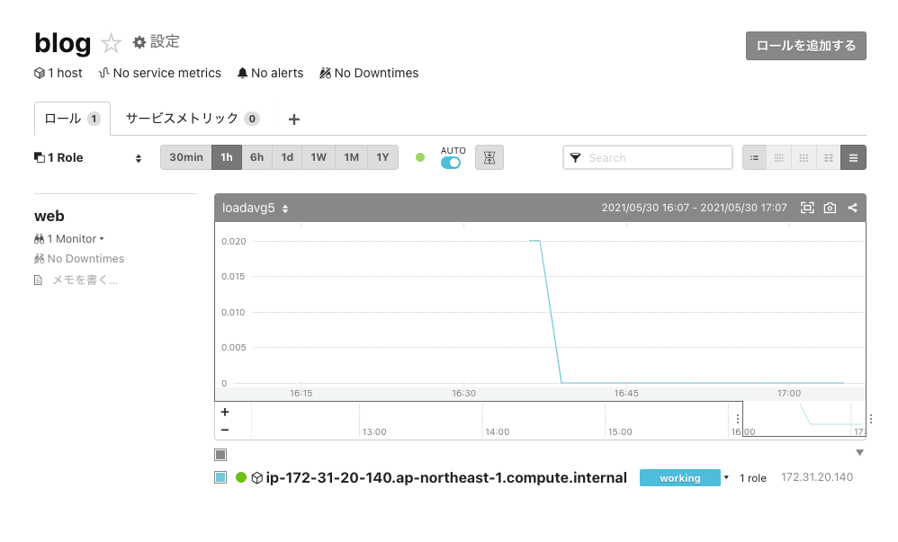

# サービス／ロールでホスト管理をする

Mackerelではホスト1台1台を管理・監視するのではなく、適切な単位でグルーピングをする「サービス」と「ロール」という概念で効率的にホストを管理・監視する方法を提供しています。

- [「サービス」「ロール」とは - Mackerel ヘルプ](https://mackerel.io/ja/docs/entry/spec/about-service-role)

このハンズオンでは新たに登録されたホストを「サービス」と「ロール」に所属させてみましょう。

## サービス／ロールを作成する

左サイドメニューの[Services](https://mackerel.io/my/services)にアクセスして、`サービスを新規作成`から新規サービスを追加しましょう。

任意のサービス名を指定してサービスを作成します。（ここでは`blog`というサービスにします。）

続いて作成したサービスを開き、`ロールを新規作成`から新規ロールを追加します。

任意のロール名を指定してロールを作成します。（ここでは`web`というロールにします。）

これで`blog`サービスに`web`ロールが作成されました。

以下のように`web`ロールのグラフが表示されていることが確認できますが、この時点ではロールにホストが紐付いていない状態のため空表示となります。

## ホストとサービス／ロールを紐付ける

左サイドメニューの[Hosts](https://mackerel.io/my/hosts)を開き、先ほど追加したホストを作成したサービス／ロールに所属させます。
`サービス: ロールを設定`から作成したサービス／ロールを選択します。

これでサービス／ロールにホストが追加されました。少し時間をおいてロールグラフを確認してみます。

## ロールグラフを確認する

[Services](https://mackerel.io/my/services)から再びロールグラフを表示してみます。

ホストが追加され、ロールグラフが表示されていることが確認できましたね。

