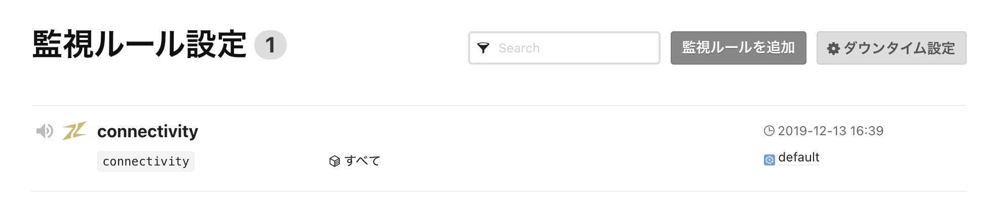
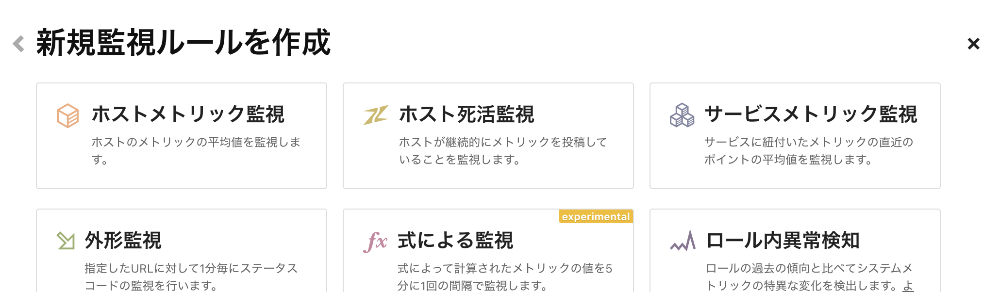
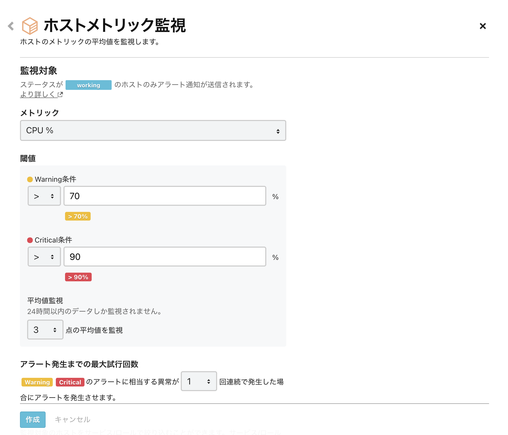
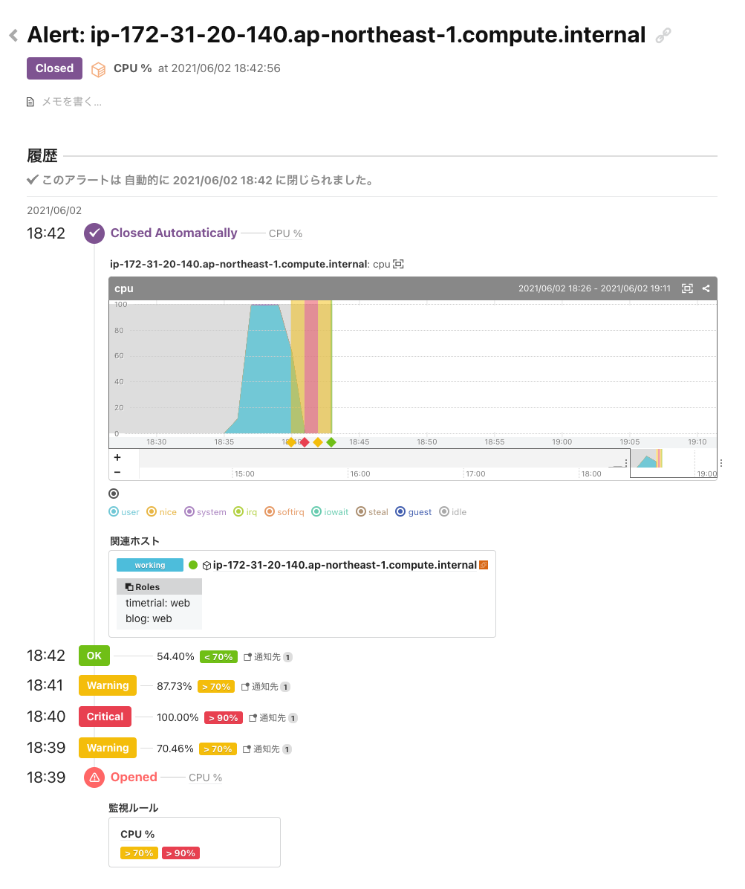

# 監視ルールを追加する

このハンズオンでは監視ルールを設定して擬似的な障害を起こし、Mackerelでの障害対応を体験します。

## ホストのメトリックを監視する
以下の手順に沿って、CPU使用率を監視するルールを設定してみましょう。

まずは左サイドメニュー[Monitors](https://mackerel.io/my/monitors)を開き、右上の`監視ルールを追加`をクリックします。


`新規監視ルールを作成`のメニューの中から`ホストメトリック監視`を選択します。


<br/>

各項目に以下の表の内容を設定して監視ルールを作成しましょう。



| 項目 | 設定値 |
| --- | ---- |
| メトリック | CPU % |
| 閾値（Warning条件） | 70 |
| 閾値（Critical条件） | 90 |
| 平均値監視 | 1点の平均値を監視 |
| 最大試行回数 | 1回 |
| 絞込条件 | 変更しない |
| 監視ルール名 | 任意 |
| 監視ルールのメモ | 任意 |
| 通知の再送間隔 | チェックしない |

[Monitors](https://mackerel.io/my/monitors)にホストメトリック監視のルールが追加されたことを確認します。

## 監視対象サーバー上で障害を起こす

続いて、監視対象サーバーにログインしたあとに、以下のコマンドを実行し意図的に CPU に負荷を掛けてみます。

```shell
yes > /dev/null
```
- `yes`コマンドは標準出力に`y`を延々と出力し、その出力をただ捨てるだけのコマンドです。

実行したら、少し時間をおいて変化を見てみましょう。

## Webコンソールでアラートを確認する

- 左サイドメニュー[Hosts](https://mackerel.io/my/hosts)から詳細画面を表示して、CPU使用率のグラフを確認しましょう。
- アラートが発報されたら左サイドメニュー[Alerts](https://mackerel.io/my/alerts)を確認し、発報されたアラート詳細画面を確認してみましょう
- 通知されたアラートメールも確認してみましょう

ここまでで、Mackerelではサーバーのグラフがどのように表示され、障害が発生した時の対応をどのように実施するかイメージいただけたでしょうか？

それでは障害を解消してみましょう。ターミナル上で`Ctrl+C`を入力して`yes`コマンドを中断し、数分後にCPUのグラフとアラートにどのような変化が起こるか見てみましょう。



アラートが発報してからのステータスの遷移が記録され、アラートが自動的にクローズされたことを確認いただけたかと思います。
この様にMackerelでは障害が解消したことを検知して、自動的にアラートをクローズする仕組みとなっています。

次のハンズオンでは公式プラグインを導入して、監視を拡張してみましょう。
