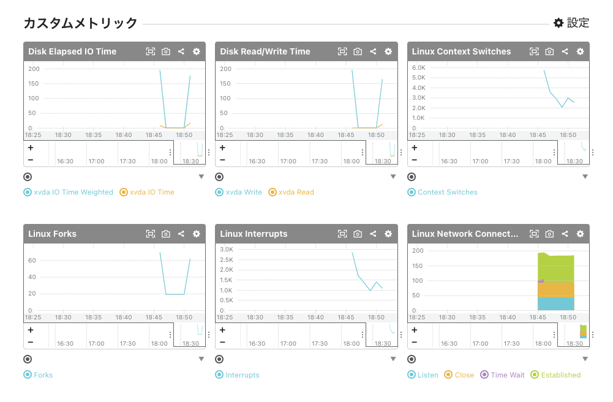

# 公式メトリックプラグインを導入する

監視対象ホストに公式メトリックプラグインをインストールしてOS、ミドルウェアの監視をしてみましょう。

## 公式プラグインをインストールする

監視対象サーバーで以下のコマンドを実行し、公式プラグインをインストールします。

```shell
sudo yum install -y mackerel-agent-plugins
```

完了したら、インストールされたプラグインを見てましょう。

```shell
ls -l /usr/bin/mackerel-plugin-*
```

50を超えるプラグインがインストールされていることを確認していただけるかと思います！

Mackerelの公式プラグイン集は以下のGitHubリポジトリで公開されています。OSS（オープンソースソフトウェア）なのでいつでも誰でも実装を確認できますし、修正や機能追加なども可能です。

- [https://github.com/mackerelio/mackerel-agent-plugins](https://github.com/mackerelio/mackerel-agent-plugins)


それでは数あるプラグインのうちLinuxに関するメトリック監視を拡張する`mackerel-plugin-linux`をセットアップしてみましょう。

## OSに関するメトリックを拡張してみる

公式プラグインパッケージに含まれている mackerel-plugin-linux プラグインを使用して、Linux OSに関するメトリックを拡張してみます。

mackerel-agent に mackerel-plugin-linux プラグインを導入するには設定ファイル `/etc/mackerel-agent/mackerel-agent.conf` をviなどで開いて以下の2行を追記します。

```toml
[plugin.metrics.linux]
command = "mackerel-plugin-linux"
```

以下のコマンドをターミナルで実行することでも追記できます。

```shell
sudo sh << SCRIPT
cat >>/etc/mackerel-agent/mackerel-agent.conf <<'EOF';

[plugin.metrics.linux]
command = "mackerel-plugin-linux"
EOF
SCRIPT
```

特にエラーなどが発生せず、再びコマンドが入力できる状態になっていれば成功です。（完了メッセージなどは表示されません）

mackerel-agent.conf を変更した際に有効なシンタックスチェック機能が mackerel-agent には備わっています。次のコマンドを実行してみましょう。

```shell
mackerel-agent configtest
```

次のような結果が出力されていれば記載ミスなどがないことを確認できます。

```
/etc/mackerel-agent/mackerel-agent.conf Syntax OK
```

問題なければ、以下のコマンドにより mackerel-agent を再起動します。

```shell
sudo systemctl restart mackerel-agent
```

ps コマンドなどで mackerel-agent が起動していることを確認しましょう。

```shell
ps aux | grep mackerel-agent
```

### プラグインを手動で実行してみる

本来はエージェントに組み込み、エージェントが実行するプラグインですが、人の手で実行することも可能です。
以下のコマンドにより実行してみて、どのような結果が得られるか確認してみましょう。

```shell
sudo mackerel-plugin-linux
```

以下のような結果が表示されればプラグインが正常に実行されています。

```shell
linux.users.users	1.000000	1620797938
linux.swap.pswpin	0.000000	1620797938
linux.swap.pswpout	0.000000	1620797938
linux.ss.ESTAB	89.000000	1620797938
linux.ss.UNCONN	51.000000	1620797938
linux.ss.LISTEN	42.000000	1620797938
 :
```

メトリックプラグインは規定のフォーマットで監視結果を標準出力をする仕様となっています。仕様に沿って実装され、サーバー上で実行が可能であれば開発言語は問わずオリジナルのプラグインを実装できます。

- [ホストのカスタムメトリックを投稿する - Mackerel ヘルプ](https://mackerel.io/ja/docs/entry/advanced/custom-metrics#post-metric)

それでは設定したプラグインのメトリックがホストに反映されているか確認してみましょう。

### プラグインのメトリックを確認する

[Hosts](https://mackerel.io/my/hosts)から設定したホストの詳細画面を開いて確認してみましょう。



プラグインが取得したメトリックはカスタムメトリックとしてホストに投稿されている事が確認できました。

Mackerelでは mackerel-agent が収集するメトリックはシステムメトリック、プラグインが収集するメトリックはカスタムメトリックとして分類されます。

次のハンズオンではサーバーの状態を確認するチェック監視プラグインを導入してみます。
