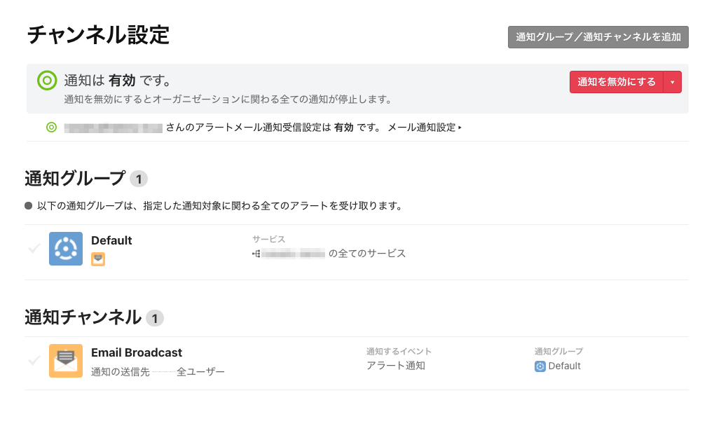
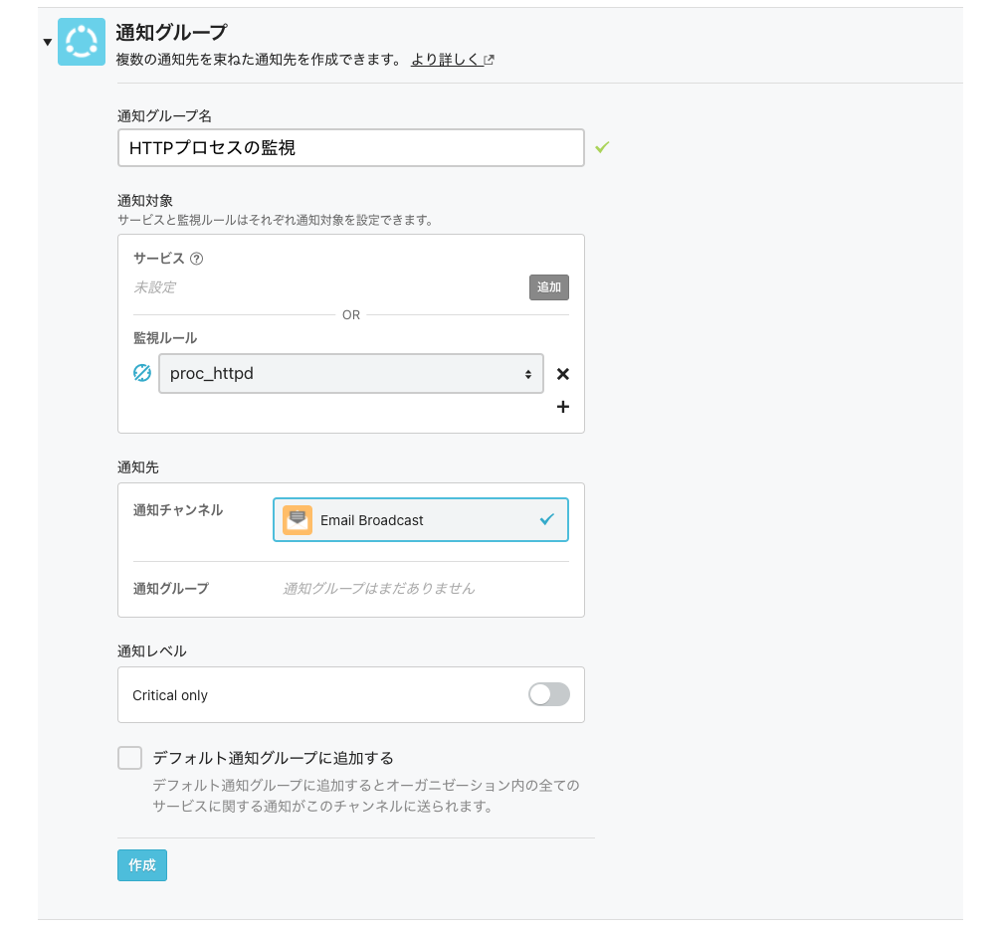
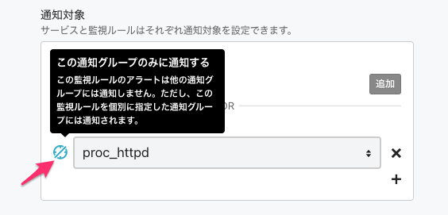

# 通知をカスタマイズする

Mackerelでは障害の発生を検知するとアラートが発報され、デフォルトではオーガニゼーションに所属しているメンバーのメールアドレスに対してアラート通知を行う設定がされています。

## チャンネル設定を確認する

左サイドメニューから[Channels](https://mackerel.io/my/channels)を開いて確認してみましょう。



初期状態では`Default`の通知グループと`Email Broadcast`の通知チャンネルが登録されています。

通知チャンネルでは通知方法と通知するイベントを、通知グループでは通知対象とするサービスや監視ルールとそれらの通知先となる通知チャンネルを指定することで、監視ルールごとに通知先を振り分けるなどのコントロールができます。

`Default`の通知グループではオーガニゼーションの全てのサービスの通知を`Email Broadcast`のチャンネルに通知するように設定されていることがわかるかと思います。

## 通知グループを追加する

このハンズオンでは通知グループを新しく追加して、任意の監視ルールの通知を作成した通知グループにだけ通知されるような設定をしてみましょう。

まずは[Channels](https://mackerel.io/my/channels)の右上にある`通知グループ／通知チャンネルを追加`から通知グループを追加します。



1つ前のハンズオンで設定したhttpdプロセスの監視に関するアラートのみ通知する通知グループとして以下のように設定します。

| 項目 | 設定値 |
| --- | ---- |
| 通知グループ名 | `HTTPプロセスの監視`（任意） |
| サービス（通知対象） | 未設定 |
| 監視ルール（通知対象） | `proc_httpd`を指定 |
| 通知チャンネル（通知先） | `Email Broadcast` |
| 通知グループ（通知先） | 未設定 |
| Critical Only（通知レベル） | 変更しない |
| デフォルト通知グループに追加する | チェックしない |

この様に設定すると特定の監視ルールのみ通知することができますが、`Default`通知グループでも`proc_httpd`の通知が行われるため二重で通知が行われてしまいます。

今回追加した通知グループにのみ`proc_httpd`の通知を行うには`この通知グループのみに通知する`にチェックをつけることで二重通知を抑止できます。



それではサーバー上でhttpdプロセスを停止してアラートが発報されることを確認しましょう。

```shell
sudo systemctl stop httpd
```

1分程度待つとアラートが発報して通知メールが1通届いたかと思います。

現時点では`Email Broadcast`の通知チャンネルしかないため通知グループによる通知の振り分けを感じられませんが、Twilioのハンズオンで作成したアカウントと連携した架電通知を後ほど試してみましょう！

Mackerelのハンズオンはここまでとなりますので、httpdプロセスを起動して障害を解消させます。

```shell
sudo systemctl start httpd
```

お疲れさまでした！