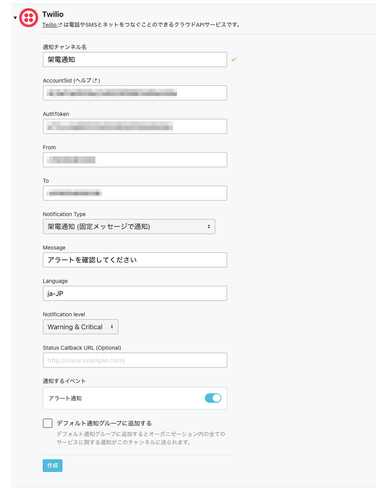
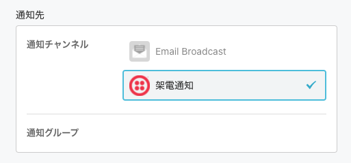
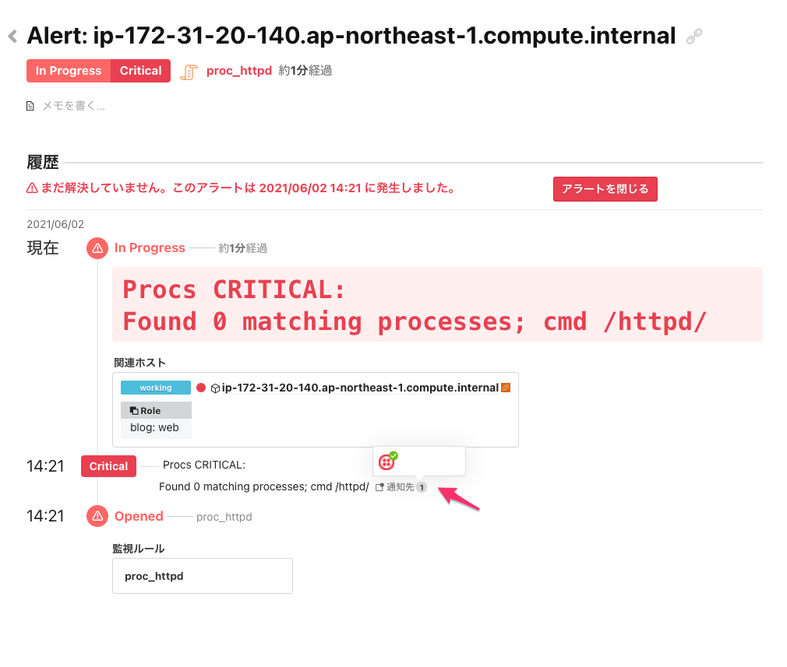

# Twilioと連携して架電通知をする

Twilioハンズオンで作成したアカウントを利用して、アラート通知をメール通知ではなく電話による架電通知する設定を行ってみましょう。

## Twilioの通知チャンネルを作成する

左サイドメニューから[Channels](https://mackerel.io/my/channels)を開いて、右上にある`通知グループ／通知チャンネルを追加`からTwilioの通知チャンネルを追加します。



Twilioのハンズオンで作成したアカウントで払い出された`ACCOUNT SID`と`AUTH TOKEN`、`電話番号`などを入力して保存してください。

| 項目 | 設定値 |
| --- | ---- |
| 通知チャンネル名 | `架電通知`（任意） |
| AccountSid | [Twilioのコンソール](https://www.twilio.com/console)から`ACCOUNT SID`を転記 |
| AuthToken | [Twilioのコンソール](https://www.twilio.com/console)から`AUTH TOKEN`を転記 |
| From | [Twilioのコンソール](https://www.twilio.com/console/phone-numbers/incoming)から確保した電話番号を転記 |
| To | 着信可能な電話番号を入力（電話番号の前に`+81`を付加してください） |
| Notification Type |  |
| Message | `アラートを確認してください`（発話させる内容を入力） |
| Language | `ja-JP` |
| Notification Level | `Warning & Critical` |
| Status Callback URL(Optional) | （未設定） |
| 通知するイベント | （変更しない） |
| デフォルト通知グループに追加する | チェックを外す |

通知チャンネルにTwilioのチャンネルが追加されていることを確認してみましょう。

## 通知グループに紐付ける

次にハンズオンで作成した通知グループ（手順通りだと`HTTPプロセスの監視`のグループ）の通知先のチャンネルを`Email Broadcast`から追加したTwilioのチャンネルに変更します。



わかりやすくするために`Email Broadcast`のチャンネルはオフにしておきましょう。

## 障害を起こして通知の確認をする

それでは障害を起こして通知を確認してみましょう。

前回と同様にサーバー上でhttpdプロセスを停止してアラートが発報されることを確認しましょう。

```shell
sudo systemctl stop httpd
```

指定した電話番号宛に架電され、指定したメッセージによる通知が行われたでしょうか？

[Alerts](https://mackerel.io/my/alerts)を確認すると、通知先が作成したTwilioのチャンネルにのみ通知されていることが確認できるかと思います。



Twilioとの連携はいかがでしたでしょうか？とても簡単に連携ができることを体験いただけたかと思います！

ぜひ、本番環境などを監視される際はTwilioとの連携も併せてお試しください！
