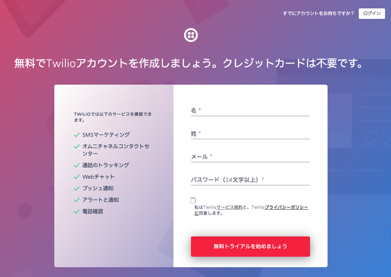
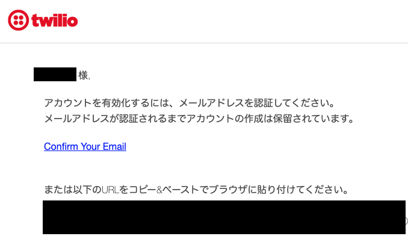
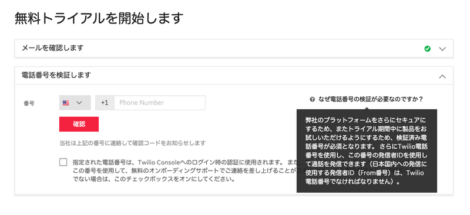
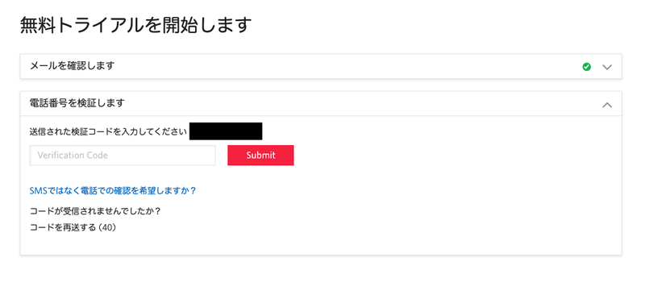

# Twilioアカウントの作成

__注:サインアップフローは頻繁に更新されるためこの手順とは異なる表示になっている場合があります。その場合は画面の説明をお読みいただき、アカウントを作成してください。__

この手順ではTwilioアカウントを作成します。アカウントは無料で作成でき、15米国ドル（約1,500円）の無料トライアルクレジットがついています。

今回のハンズオンではこのトライアルクレジットの範囲内で実施可能です。

## Twilioホームページでアカウントをサインアップ

[Twilioホームページ](https://www.twilio.com/ja/)をブラウザーで開き、画面右上の[無料サインアップ](https://jp.twilio.com/try-twilio)ボタンをクリックします。

名、姓、メール、パスワード(14文字以上)を入力します。また、サービス規約とブライバシーポリシーに同意することを示すボックスをチェックし、`無料トライアルを始めましょう`ボタンをクリックします。

サインアップ後、登録したEmailに確認メールが送られます。メール本文の `Confirm Your Email` リンクをクリックし、アカウントを有効化させます。

## 電話番号を確認

リンクをクリックすると、続けて電話番号の確認が行われます。国を選択後、電話番号を入力し確認 ボタンをクリックすると、確認コードが送信されます。

送られてきたコードを入力し、`Submit`ボタンをクリックします。

電話番号の確認が完了すると利用用途や製品、プログラミング言語などいくつかの質問が画面に表示されます。選択によって利用できる機能は変わるわけではないので、回答を選択せずダッシュボードにスキップいただいても構いません。

ここで使用した電話番号は`検証済み電話番号`として認識されます。詳細についてはこの次のセクションをご覧ください。

これでアカウントの作成が完了しました。

## トライアルアカウントの制限について

トライアルアカウントを利用する場合は、以下のような [制限](https://support.twilio.com/hc/en-us/articles/360046044073-%E3%83%88%E3%83%A9%E3%82%A4%E3%82%A2%E3%83%AB%E3%82%A2%E3%82%AB%E3%82%A6%E3%83%B3%E3%83%88%E5%88%B6%E9%99%90%E4%BA%8B%E9%A0%85)があります。

- トライアルアカウントで取得できる電話番号は１つのみです。複数の番号を取得する場合は、[アカウントをアップグレード](https://support.twilio.com/hc/en-us/articles/360058276434-Twilio%E6%9C%89%E6%96%99%E3%82%A2%E3%82%AB%E3%82%A6%E3%83%B3%E3%83%88%E3%81%B8%E3%81%AE%E3%82%A2%E3%83%83%E3%83%97%E3%82%B0%E3%83%AC%E3%83%BC%E3%83%89%E6%96%B9%E6%B3%95)する必要があります。
- トライアルアカウントから送信、架電できる番号はアカウント作成時に確認コードを受け取った番号を含む[検証済電話番号](https://jp.twilio.com/console/phone-numbers/verified)のみです。
- SMSや電話の冒頭にトライアルアカウントを利用している旨を伝えるメッセージ（英語）が表示・再生されます。

