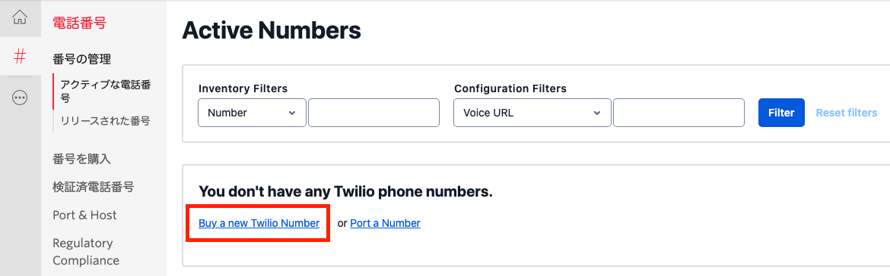
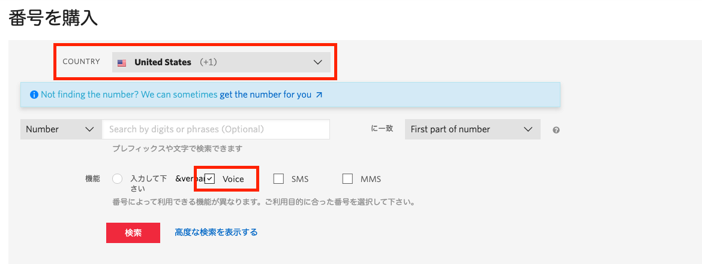
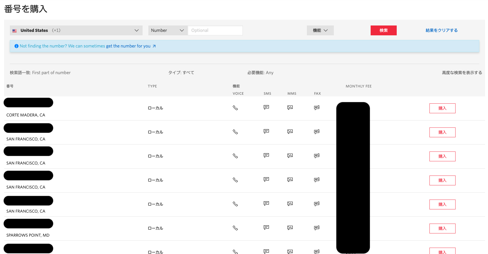

# Twilioから電話番号を取得する

ここではTwilioの管理画面である[コンソール](https://jp.twilio.com/console)にアクセスし、架電・SMS通知の発信元となる電話番号をTwilioから購入します。

__注:Twilioが提供する電話番号の購入、維持には費用が発生します。トライアルアカウントを利用する場合は無料のトライアルクレジットを利用できます。トライアルクレジットがなくなった場合はサービスが停止され、アカウントのアップグレードが必要になります。__

すでにTwilio番号を保有している場合はページ最下部のリンクから次のハンズオンへと進んでください。

## 番号を購入

[Twilio電話番号コンソール](https://jp.twilio.com/console/phone-numbers/incoming)を開き画面内、あるいは右上の`Buy　a　new　Twilio Number`リンク・ボタンをクリックします。

次の画面で購入可能な電話番号を検索できます。日本の番号を取得する場合、本人確認作業が発生します。本人確認作業は数時間〜数日を要するため、時間がない場合は米国番号を取得します。

電話番号を購入した場合、回線維持料金が必要になります。国、電話番号の種類により料金が変わります。ただしトライアルアカウントの場合、トライアル用の無料クレジットが使用されるため追加費用を支払う心配はありません。

`COUNTRY`欄をUnited Statsと設定し、`機能`欄の`Voice`にチェックを入れ、`検索`ボタンをクリックします。

購入可能な番号一覧が表示されます。

好きな番号を選び、`購入`ボタンを押し、月額費用を確認の上、購入してください。前述の通り、トライアルアカウントの場合は無料クレジットが付与されているため、費用の請求はありません。

ここで購入した番号を控えておきます。この番号は後ほどMackerel側で連携設定を行う際に使用します。また、その際に`+`からはじまる[E.164形式](https://www.twilio.com/docs/glossary/what-e164)で番号を控えておきます。例えば`090-xxxx-yyyy`の場合は`+8190xxxxyyyy`となります。

# 参考情報

## 日本番号の取得について

日本の電話番号を購入する場合は住所ならびに[本人情報を本人書類を添えて登録](https://support.twilio.com/hc/en-us/articles/360044400214)し、本人確認が必要です。この手続きには数時間から数日を要します。