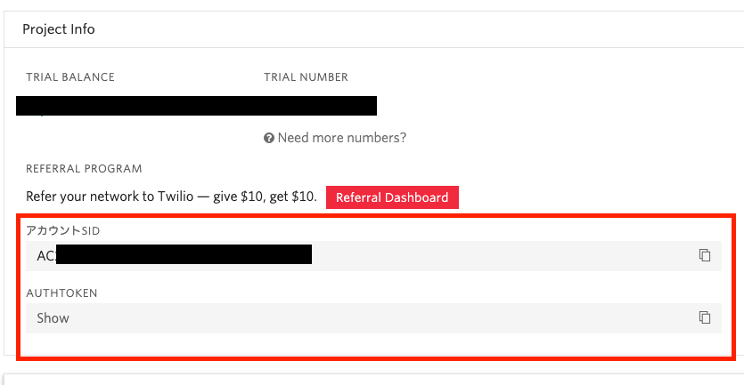

# Twilioと連携して架電通知をする

さきほど作成したアカウントを利用して、アラート通知をメール通知ではなく電話による架電通知する設定を行ってみましょう。

## Twilio APIを利用するための資格情報を確認する

TwilioのAPIを利用する場合は`ACCOUNT SID`、`AUTH TOKEN`と呼ばれる資格情報が必要になります。

[Twilioコンソール](https://jp.twilio.com/console/)を開き、`アカウント SID`、`Auth Token`をそれぞれ控えておきます。



### __Auth Token__ について

`Auth Token`はパスワードに値する非常に __重要な情報__ なので、`アカウント SID`と共に外部に流出しないように取り扱いについては十分注意してください。

## Twilioの通知チャンネルを作成する

左サイドメニューから[Channels](https://mackerel.io/my/channels)を開いて、右上にある`通知グループ／通知チャンネルを追加`からTwilioの通知チャンネルを追加します。


Twilioのハンズオンで作成したアカウントで払い出された`ACCOUNT SID`と`AUTH TOKEN`、`電話番号`などを入力して保存してください。

| 項目 | 設定値 |
| --- | ---- |
| 通知チャンネル名 | `架電通知`（任意） |
| AccountSid | [Twilioのコンソール](https://jp.twilio.com/console)から`ACCOUNT SID`を転記 |
| AuthToken | [Twilioのコンソール](https://jp.twilio.com/console)から`AUTH TOKEN`を転記 |
| From | [Twilioのコンソール](https://jp.twilio.com/console/phone-numbers/incoming)から確保した電話番号を[E.164形式](https://www.twilio.com/docs/glossary/what-e164)で転記 |
| To | 着信可能な電話番号を[E.164形式](https://www.twilio.com/docs/glossary/what-e164)で入力（Twilioアカウントがトライアル版の場合は[検証済み電話番号](https://jp.twilio.com/console/phone-numbers/verified)に登録されている番号を指定） |
| Notification Type | 架電通知（固定メッセージで通知） |
| Message | `アラートを確認してください`（発話させる内容を入力） |
| Language | `ja-JP` |
| Notification Level | `Warning & Critical` |
| Status Callback URL(Optional) | （未設定） |
| 通知するイベント | （変更しない） |
| デフォルト通知グループに追加する | チェックを外す |

通知チャンネルにTwilioのチャンネルが追加されていることを確認してみましょう。

## 通知グループに紐付ける

次にハンズオンで作成した通知グループ（手順通りだと`HTTPプロセスの監視`のグループ）の通知先のチャンネルを`Email Broadcast`から追加したTwilioのチャンネルに変更します。


わかりやすくするために`Email Broadcast`のチャンネルはオフにしておきましょう。

## 障害を起こして通知の確認をする

それでは障害を起こして通知を確認してみましょう。

前回と同様にサーバー上でhttpdプロセスを停止してアラートが発報されることを確認しましょう。

```shell
sudo systemctl stop httpd
```

----

__トライアルアカウント__ の場合は最初にトライアル版を利用中であるというメッセージが再生されます。全文は下記の通りです。このメッセージはスキップできません。そのため最後までこのメッセージを聞いてください。

> *You have a trial account. You can remove this message at anytime by upgrading to full account. Press any to execute your code.*

メッセージの再生後に何かキーを押すと指定したメッセージを再生できます。日本語のメッセージが再生されることを確認しましょう。

----

指定した電話番号宛に架電され、指定したメッセージによる通知が行われたでしょうか？

[Alerts](https://mackerel.io/my/alerts)を確認すると、通知先が作成したTwilioのチャンネルにのみ通知されていることが確認できるかと思います。


アラートが確認できたら障害から復旧させましょう。

```shell
sudo systemctl start httpd
```

## 音声ではなく、SMSでアラートを受け取るには

音声通話ではなくSMSでアラートを受け取る場合は
次のように設定項目を変更します。

| 項目 | 設定値 |
| --- | ---- |
| Notification Type | SMS |

この場合は固定のメッセージが送信されます。
