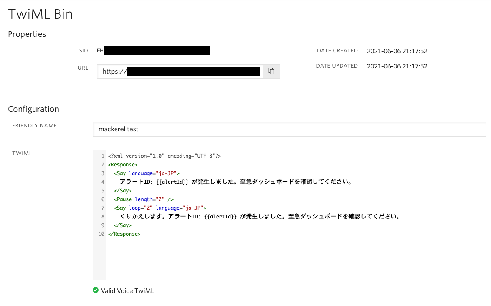

# TwiMLエンドポイントを利用する

さきほどは静的な文言を通知に利用しました。このセクションでは`TwiML`エンドポイントを利用し動的なメッセージを構築できます。

## TwiMLとは？

[TwiML](https://www.twilio.com/docs/glossary/what-is-twilio-markup-language-twiml)は`Twilio Markup Language`の略でありTwilioが提供する音声、メッセージAPIで利用できるマークアップ言語です。

例えば「障害が発生しました」というメッセージを再生したい場合は[Say](https://jp.twilio.com/docs/voice/twiml/say)句を使って次のように表現できます。

```xml
<?xml version="1.0" encoding="UTF-8"?>
<Response>
    <Say language="ja-JP">障害が発生しました</Say>
</Response>
```

また、リクエストにパラメータが渡されている場合は[テンプレート](https://support.twilio.com/hc/en-us/articles/230878368-How-to-use-templates-with-TwiML-Bins)を利用し、動的なメッセージを作成できます。

## TwiML Binsを用いてエンドポイントを代用する

TwiMLエンドポイントは自社で提供するWebアプリケーションのURL、またはAWSなどのクラウドサービスにホスティングされたエンドポイントなどを指定できます。複雑でないメッセージを通知する場合はTwilioが提供するTwiML専用エンドポイントである`TwiML Bins`を利用できます。

## TwiML Binを作成

[Twilioコンソール - TwiML Bins](https://jp.twilio.com/console/twiml-bins)を開き、`Create new TwiML Bin`ボタンをクリックします。

`FRIENDLY NAME`フィールドにはわかりやすい名前を入れ、`TWIML`フィールドには以下を追加します。

```xml
<?xml version="1.0" encoding="UTF-8"?>
<Response>
  <Say language="ja-JP">
    アラートID: {{alertId}} が発生しました。至急ダッシュボードを確認してください。
  </Say>
  <Pause length="2" />
  <Say loop="2" language="ja-JP">
    くりかえします。アラートID: {{alertId}} が発生しました。至急ダッシュボードを確認してください。
  </Say>
</Response>
```

ここまでの入力例は下記のスクリーンショットのようになります。`TWIML`フィールド下部に`Valid Voice TwiML`と表示されていることを確認してください。




このTwiMLはMackerel側から渡される`alertId`の値を通知先に伝えています。このidは[アラート API](https://mackerel.io/ja/api-docs/entry/alerts)で利用できるため、TwiMLエンドポイントを独自のWebエンドポイント、またはTwilio FunctionsやAWS LambdaなどのFaaSで構築し、さらに複雑な情報を通知できます。

この画面に表示されているURLを控えておきます。

## 架電通知チャンネルを編集

Mackerelダッシュボードの[Channel](https://mackerel.io/my/channels)を開き、`架電通知`チャンネルの`編集`ボタンをクリックします。

通知設定が表示されるのでそれぞれ次の項目を変更します。

| 項目 | 設定値 |
| --- | ---- |
| Notification Type | `架電通知 (TwiML エンドポイントを指定して通知)` |
| URL | 先ほど取得した TwiML BinのURL |


## 障害を起こして通知の確認をする

それでは障害を起こして通知を確認してみましょう。

サーバー上でhttpdプロセスを停止してアラートが発報されることを確認しましょう。

```shell
sudo systemctl stop httpd
```

指定した電話番号宛に架電され、指定したTwiMLによる通知が行われたでしょうか？

アラートが確認できたら障害から復旧させましょう。

```shell
sudo systemctl start httpd
```

Twilioとの連携はいかがでしたでしょうか？とても簡単に連携ができることを体験いただけたかと思います！

ぜひ、本番環境などを監視される際はTwilioとの連携も併せてお試しください！