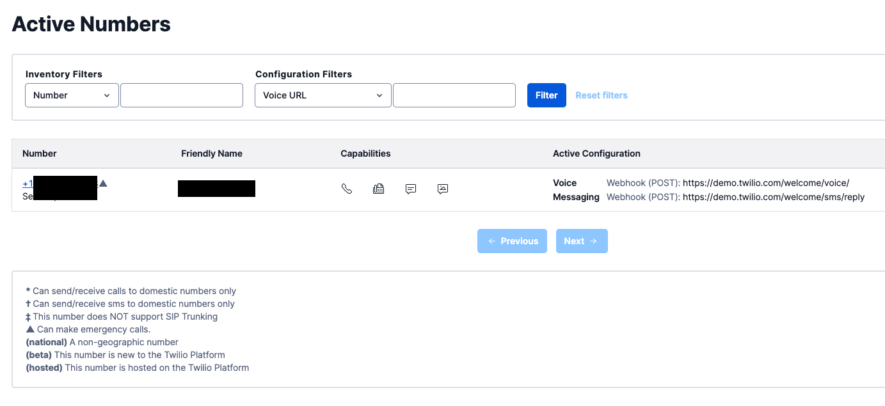
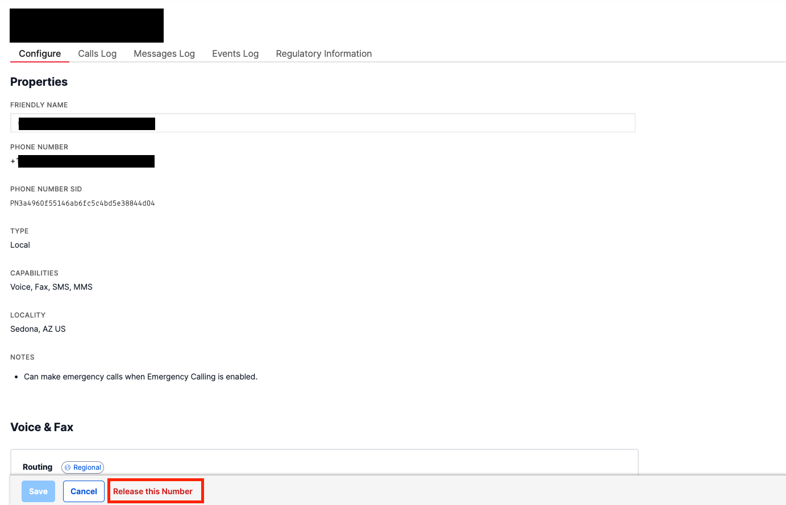

# Twilioの料金体系

Twilioはあらかじめアカウントにチャージしたクレジットが使用量に引き落とされる従量課金体系となっています。

ただし、電話番号に関しては回線費用が月額でかかるため、ハンズオン終了後に不要になる場合は忘れずに番号をリリースします。

## 購入した電話番号をリリース

[Twilio電話番号コンソール](https://jp.twilio.com/console/phone-numbers/incoming)を開き一覧から不要となった電話番号をクリックします。

詳細画面の最下部に表示されている`Release this Number`をクリックし不要になった番号をリリースします。

今回利用したTwiML Binsについては資料作成時点（2021年6月）で無料となっています。