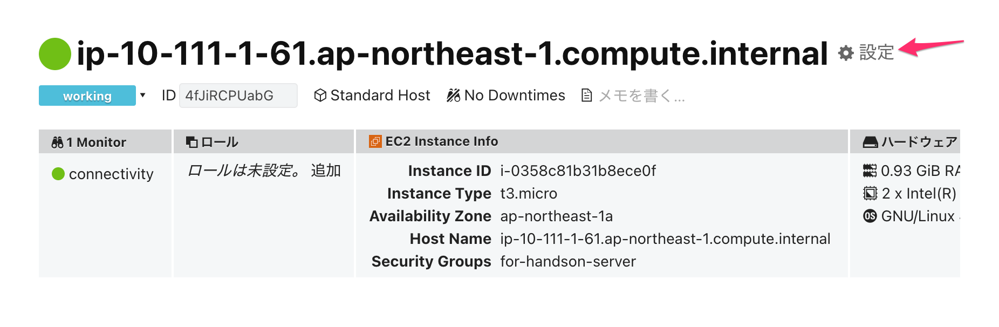
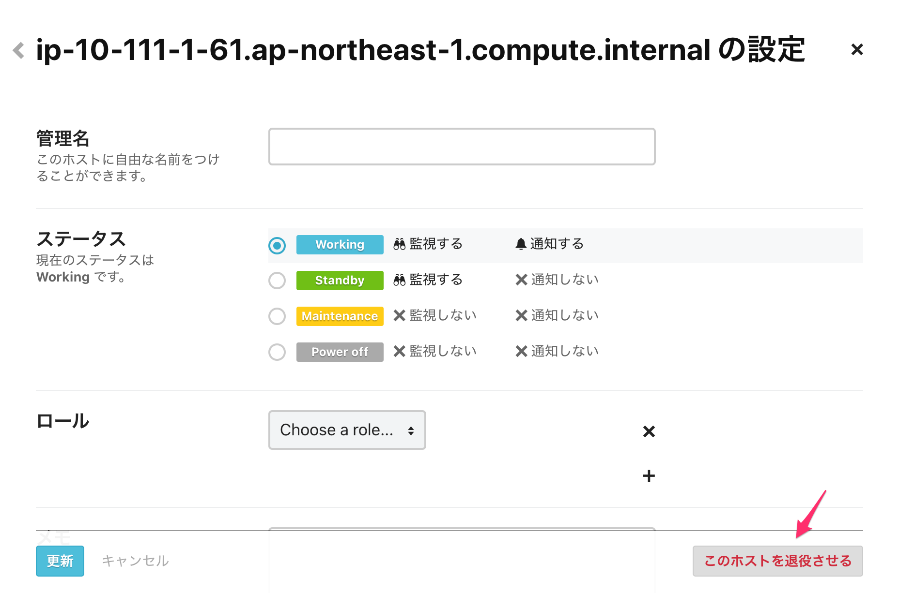

# ホストを退役する

**セミナー終了後にご対応ください！**

今回使ったサーバーは、セミナー終了後にシャットダウンします。

今の状態のままシャットダウンしてしまうと、監視ルール「connectivity」に抵触することになり、参加者のみなさんにメール通知が送信されてしまいます。 そのため、セミナーの最後に今回使ったサーバーを Mackerel の管理対象から外す作業をお願いします。

左サイドメニュー[Hosts](https://mackerel.io/my/hosts)から今回使用したホスト詳細画面を開いて、上部に表示されているホスト名の右横にある歯車アイコンをクリックします。

ホストの設定画面が開くので、右下にある`このホストを退役させる`からホストを退役してください。

この作業でオーガニゼーションからホスト退役が行われ、監視対象からホストが外れました。